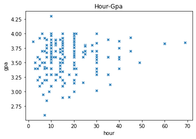
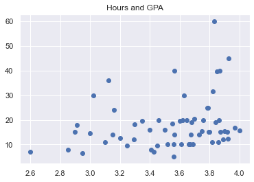

# GPA-Analysis
I analyzed the GPAs of the students given their number of study hours.

# Table of contents

<a href="#1">1. Adjusting the data</a>  
<a href="#2">2. Data Visualization </a> 

<a href="#todo">TODO</a>  
<a href="#tools">Tool and packages</a> 


<a id="1"></a>

## 1. Adjusting the Data
- introduce to basic setup of folder, install `pandas`, `matplotlib`, `seaborn` (using `pip` for Python package), `Anaconda` is a good choice if you are using Windows (or even Mac, Linux). Alternatively, try out [**Google Colaboratory**](https://colab.research.google.com/)
- basic use of those tools (clean, explore, plot, interpret)
- The dataset used in the project [Dataset](https://www.kaggle.com/datasets/himanshunakrani/student-study-hours/)
- here are some steps to get the data into proper format
 
```python
df = pd.read_csv("gpa_study_hours.csv") # downloading the data
df = df.rename(columns={"study_hours":"hour"})

df = df[df["gpa"]<= 4]

newdb = df.groupby("gpa").mean()

```

  <a id="2"></a>
## 2. Data Visualization

- here are some graphs produced from this exercise
  
  - Scatter Plot 1
  <p align="center">
    
  </p>
  
  - Scatter Plot 2
  <p align="center">
    
  </p>
 
